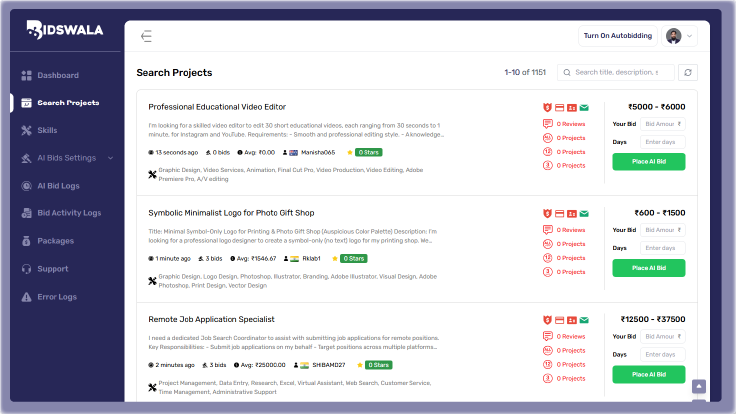

# Freelance Auto Bidding Bot (Bidswala )

Bidswala is a smart **freelance auto bidding bot** built specifically for **Freelancer.com** users. It helps freelancers save time, bid faster, and increase their chances of winning projects without manually submitting proposals all day.

---

## Features

- **Automatic Bidding**: Scan and bid on projects the moment they’re posted.  
- **Custom Filters**: Target projects that match your skills, budget, and preferences.  
- **Personalized Templates**: Make sure your proposals always sound professional and human.  
- **24/7 Operation**: Never miss an opportunity, even while you sleep.  
- **Time-Saving**: Focus on delivering work instead of hunting for jobs.

---

## How It Works

1. Set your **skills and project preferences** in the bot.  
2. Bidswala scans **Freelancer.com** for matching projects.  
3. The bot automatically submits your **customized proposal** in seconds.  
4. Sit back and focus on actual client work while Bidswala bids for you.

---

## Why Use Bidswala?

Freelancing on **Freelancer.com** is competitive. Clients often see the first 10–15 proposals first, and missing out on projects happens quickly.  

**Bidswala acts like a digital assistant**, ensuring you are always early, consistent, and visible without spending hours manually bidding.

---

## Getting Started

>  Note: This repository is primarily for branding and documentation purposes. Full bot code is not publicly shared.

1. Visit [Bidswala Website](https://www.bidswala.com/) to learn more.  
2. Check out guides, screenshots, and FAQs in this repo.  
3. Stay updated with new features and tips by following the repository.

---

## Screenshots

> Add images of the Bidswala dashboard or auto bidding in action here:
> ## Screenshots

---

## FAQ  

**Q: What is Bidswala?**  
**A:** Bidswala is a freelance auto bidding bot that automates the process of finding and bidding on projects on platforms like Freelancer.com. It saves you hours of manual work and helps you land more jobs with less effort.  

**Q: How does the auto bidding work?**  
**A:** It’s simple. Once you set your skills, budget, and preferences, Bidswala scans Freelancer.com for matching projects and instantly submits personalized bids using AI — no manual clicking required.  

**Q: Is Bidswala suitable for all freelancers?**  
**A:** Absolutely. Whether you’re a developer, designer, writer, or even a freelance architect making $10,000+ a month, Bidswala is designed to work across every skill and industry.  

**Q: Do I need to install anything?**  
**A:** No installation is needed. You can use Bidswala directly from your browser. Just log in, set your preferences, and the auto bidding starts running for you.  

